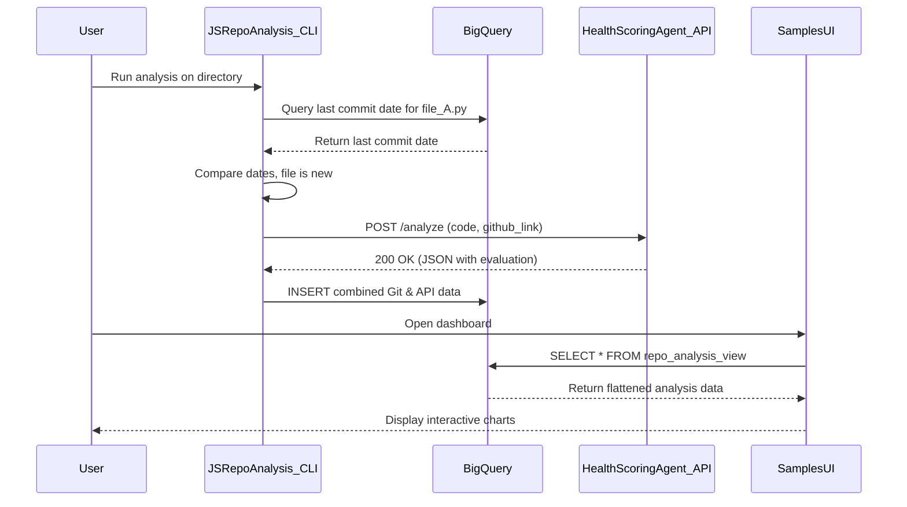

# Solution Design: AI-Powered Code Analysis Ecosystem

## 1. Solution Overview

This document provides a detailed architecture and product definition for an integrated code analysis solution. This ecosystem is comprised of three distinct projects designed to work in concert:

1.  **JSRepoAnalysis**: A powerful command-line tool for orchestrating the analysis of code quality and categorization of code samples from local or remote Git repositories.
2.  **HealthScoringAgent**: A dedicated, external API that performs the heavy lifting of AI-powered code evaluation and product categorization.
3.  **SamplesUI**: A web-based dashboard that provides a rich, interactive interface for visualizing and exploring the aggregated analysis results.

Together, these projects create a robust pipeline for maintaining high standards of code quality and consistency. The solution empowers engineering managers with high-level trend analysis, enables tech leads to enforce standards, and provides developers with actionable feedback.

---

## 2. Architecture and Data Flow

The solution is designed as a classic data pipeline, where a command-line tool gathers and processes data, a specialized API enriches it, a data warehouse stores it, and a UI presents it.

### 2.1. Detailed Data Flow

The process from analysis to visualization follows these steps:

1.  **Initiation**: A user (e.g., developer, tech lead) or an automated CI/CD process triggers the `JSRepoAnalysis` CLI tool, providing a source such as a local directory or a CSV of GitHub URLs.
2.  **File Ingestion & Git Metadata Extraction**:
    *   The CLI tool scans the source, identifying all relevant code files.
    *   For each file, the `GitFileProcessor` module extracts critical metadata: the last commit date, the full commit history, and a permanent link to the file on GitHub.
3.  **Incremental Processing Check**: Before performing a full analysis, the tool queries the BigQuery database. If a record for a given file exists with the same last commit date, the file is skipped, saving significant time and cost on subsequent runs. This check can be overridden with the `--regen` flag.
4.  **API-based Enrichment**:
    *   For each new or modified file, the `CodeProcessor` module sends the raw code content and its GitHub URL to the `HealthScoringAgent` API.
    *   The API performs two key functions:
        1.  **Product Categorization**: Identifies the primary Google Cloud product and technology stack.
        2.  **AI Quality Evaluation**: Assesses the code against multiple quality criteria, generating scores and detailed justifications.
    *   The API returns a single, comprehensive JSON object containing all analysis results.
5.  **Data Persistence**: The `JSRepoAnalysis` tool combines the Git metadata from step 2 with the API response from step 4 and writes the final, structured record to the `repo_analysis` table in BigQuery.
6.  **Data Visualization**:
    *   The `SamplesUI` dashboard queries the `repo_analysis_view` in BigQuery.
    *   This view provides a clean, de-duplicated, and flattened representation of the data, making it easy to build visualizations.
    *   Users can interact with the dashboard to filter data, drill down into specific results, and track quality trends over time.

### 2.2. Sequence Diagram



---

## 3. Component Deep Dive

### 3.1. JSRepoAnalysis (The Orchestrator)

This Python CLI tool is the heart of the data collection process.

-   **Core Modules**:
    -   `main.py`: The entry point and orchestrator. It handles argument parsing, sets up parallel processing using `ThreadPoolExecutor`, and manages the overall workflow, including the pause/resume mechanism on consecutive errors.
    -   `CodeProcessor`: Manages the analysis of a single file, coordinating calls to the Git processor and the external API.
    -   `GitFileProcessor`: Interfaces with the local `git` command to extract commit history and file metadata.
    -   `BigQueryRepository`: Encapsulates all database interactions, providing a simple interface for checking existing records, inserting new ones, and deleting old ones during regeneration.
-   **Key Features**:
    -   **Parallel Processing**: Significantly speeds up analysis by processing multiple files and cloning repositories concurrently.
    -   **Robust Error Handling**: Logs all failures to a file and allows for easy reprocessing of only the failed files using the `--reprocess-log` flag.
    -   **Configuration Management**: Uses a `.env` file and `pydantic-settings` for clean, type-safe management of configuration variables like API URLs and BigQuery table names.

### 3.2. HealthScoringAgent (The Brains)

This external API is responsible for the core AI-powered analysis. While its internal architecture is separate, it exposes a clear contract.

-   **API Contract (Inferred)**:
    -   **Endpoint**: `POST /analyze`
    -   **Request Body**:
        ```json
        {
          "github_link": "https://github.com/user/repo/blob/main/file.py",
          "code_content": "..."
        }
        ```
    -   **Success Response (200 OK)**:
        ```json
        {
          "product_name": "BigQuery",
          "technology": "Python",
          "region_tags": ["bigquery_quickstart"],
          "evaluation": {
            "overall_score": 85,
            "criteria_breakdown": [
              { "criterion": "Runnability", "score": 90, "assessment": "Code appears runnable." },
              { "criterion": "Clarity", "score": 80, "assessment": "Variable names could be more descriptive." }
            ]
          }
        }
        ```
-   **Responsibilities**:
    -   Maintain the complex logic and prompts required for the AI model to perform accurate evaluations.
    -   Provide a scalable and performant service that can handle concurrent analysis requests.

### 3.3. BigQuery (The Central Repository)

BigQuery serves as the scalable, serverless data warehouse for all analysis results.

-   **`repo_analysis` (Table)**: The raw storage table. It uses `JSON` data types for the commit history and evaluation data, which is efficient for writes.
-   **`repo_analysis_view` (View)**: The primary interface for consumption. It performs two critical functions:
    1.  **De-duplication**: Uses a `ROW_NUMBER()` window function to ensure that only the single most recent analysis for each file is shown.
    2.  **Flattening**: Unnests the `criteria_breakdown` array from the `evaluation_data` JSON object, exposing each quality criterion as a separate column. This simplifies queries from the UI.

### 3.4. SamplesUI (The Window)

This web application provides the user-facing interface for exploring the data.

-   **Key Features (Inferred from Product Requirements)**:
    -   **High-Level Dashboard**: Displays aggregate metrics, such as the overall average quality score, the distribution of scores by product, and the number of files analyzed over time.
    -   **Filterable Table View**: A detailed table of all analyzed files, with powerful filtering options for product, technology, language, and score range.
    -   **Drill-Down View**: Clicking on a file in the table would lead to a detailed view showing:
        -   The file's metadata (last commit, author).
        -   The full code with syntax highlighting.
        -   A detailed breakdown of the AI quality evaluation, showing the score and assessment for each criterion.
-   **Technology Stack (Inferred)**:
    -   **Frontend**: A modern JavaScript framework like React or Vue.js for building a responsive and interactive single-page application.
    -   **Data Visualization**: A library like D3.js, Chart.js, or Google Charts for creating the dashboards.
    -   **Backend/BFF**: A lightweight backend-for-frontend (e.g., Node.js with Express) might be used to handle authentication and proxy requests to BigQuery.