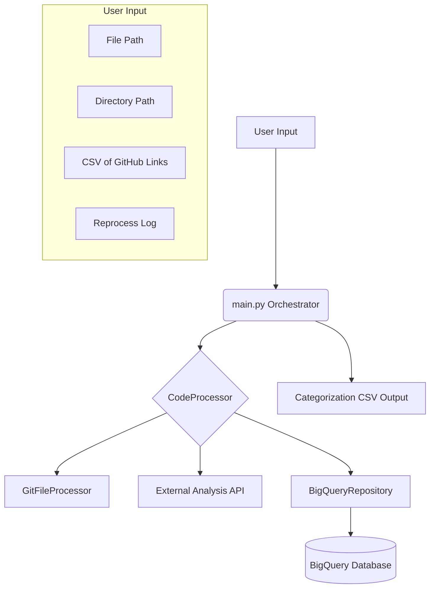
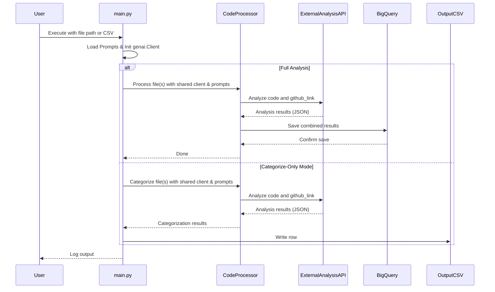

# Technical Design: JSRepoAnalysis

## Project Status

Active

## 1. Introduction

This document provides a detailed technical overview of the JSRepoAnalysis
framework, a Python-based command-line tool designed for orchestrating in-depth
code analysis via an external API. It is intended for engineers who need to
understand, maintain, or extend the system, and it covers the system's
architecture, data flow, and key technologies.

## 2. System Architecture

JSRepoAnalysis is a monolithic Python application that is designed to be run
from the command line. It is built with a modular architecture that offloads all
heavy analysis to a dedicated external API. The system is composed of a main
orchestrator, a set of core tools for file and git management, and a BigQuery
repository for data persistence.

### High-Level Architecture

### Core Components

- **`main.py`**: This is the main entry point of the application and acts as
  the central orchestrator. It is responsible for:
  - Parsing command-line arguments using the `argparse` library.
  - **Efficient Initialization**: At startup, it loads all necessary prompt
    templates from the `/prompts` directory into memory and initializes a
    single, shared `genai.Client` instance for the entire run.
  - Gathering the list of files to be processed from various sources (local
    path, directory, CSV, or reprocess log).
  - Using a `ThreadPoolExecutor` to manage a pool of worker threads for
    parallel processing of files and repositories.
  - **Passing Shared Resources**: Passing the shared `genai.Client` and the
    pre-loaded prompts to each `CodeProcessor` instance, avoiding redundant
    initializations and file reads inside the worker threads.
  - Providing `--eval-only` and `--categorize-only` modes for targeted
    analysis without database interaction.
  - **Error Handling and Pause/Resume**: After twenty consecutive processing
    errors, the application will pause and prompt the user to either continue
    or stop the execution. This is a safeguard to prevent runaway API calls in
    case of a systemic issue.

- **`get_files_from_csv`**: This function is a key part of the input
  processing logic. It is responsible for:
  - Reading a CSV file of GitHub links row by row to minimize memory usage.
  - Deduplicating URLs on the fly using a `set` for efficient lookup.
  - Extracting the unique repository names from the deduplicated links.
  - Using a `ThreadPoolExecutor` to clone or update the repositories in
    parallel.
  - Dynamically determining the default branch of each repository by calling
    `git remote show` and parsing the output. This makes the cloning process
    more robust and avoids errors when a repository's default branch is not
    named `main`.

- **`tools/code_processor.py`**: The `CodeProcessor` class is the heart of the
  application, orchestrating the analysis of a single file. It is initialized
  with the shared `genai.Client` and pre-loaded prompts from `main.py`. This
  design ensures that it does not perform any file I/O for prompts or create
  its own client, making it lightweight and efficient to instantiate within
  worker threads. It manages the analysis lifecycle, from fetching Git metadata
  to calling the external API and saving the result. It also provides
  `analyze_file_only` and `categorize_file_only` methods for specialized,
  database-free analysis.

- **`tools/`**: This directory contains the core logic of the application,
  which is separated into a set of distinct and reusable modules.
  - **`git_file_processor.py`**: The `GitFileProcessor` class uses the `git`
    command-line tool via the `subprocess` module to extract a rich set of
    metadata about a file, including its last commit date, commit history, and
    a direct link to the file on GitHub.
  - **`bigquery.py`**: The `BigQueryRepository` class encapsulates all
    interactions with the BigQuery table, providing a clean and simple
    interface for creating, reading, and deleting analysis records.

- **`utils/`**: This directory contains a set of utility modules that are used
  throughout the application.
  - **`logger.py`**: Configures a centralized logger for the application, which
    provides a consistent and easy-to-use interface for logging messages.
  - **`exceptions.py`**: Defines a set of custom exception classes that are
    used to handle specific error conditions in the application.

- **`config.py`**: This file uses the `pydantic-settings` library to load
  environment variables from the `.env` file into a `Settings` object. This
  provides a convenient and type-safe way to manage the application's
  configuration.

### BigQuery Schema

The application uses a structured BigQuery table and a flattened view to store
and analyze the data. The SQL definitions for these are located in the `BQ/`
directory.

- **`repo_analysis` (Table)**: This is the main table where all the raw
  analysis data is stored. It is designed to be write-efficient and uses a
  structured schema with top-level columns for frequently queried fields like
  `github_link`, `product_category`, and `language`. Complex, semi-structured
  data, such as the full commit history and the detailed evaluation results
  from the AI model, are stored in `JSON` columns.

- **`repo_analysis_view` (View)**: This view is the recommended interface for
  data analysis and visualization. It provides a clean, flattened
  representation of the data by:
  1. Unnesting the `criteria_breakdown` from the `evaluation_data` JSON column
     to expose each criterion's score and assessment as a top-level column.
  2. Using a `ROW_NUMBER()` window function to de-duplicate the records,
     ensuring that only the most recent evaluation for each unique
     `github_link` is included in the view. This provides a stable and
     reliable dataset for building dashboards and performing analysis.

## 3. Data Flow

The following sequence diagram illustrates the data flow of the application:

1. The user executes `main.py` from the command line, providing a file path, a
   directory path, a CSV of GitHub links, or a log file to reprocess.
2. `main.py` parses the arguments and gathers a list of files to process.
3. `main.py` loads all prompt templates and initializes a single
   `genai.Client`.
4. If `--from-csv` is used, `get_files_from_csv` clones or updates the
   repositories.
5. A `CodeProcessor` instance is created, receiving the shared client and
   prompts.
6. For each file, the `CodeProcessor` orchestrates the analysis by:
   a. Reading the raw code from the file *once*.
   b. Calling `GitFileProcessor` to get Git history and the GitHub link.
   c. Calling the external Analysis API with the GitHub link, the raw code, and the identified language.
   d. Receiving a comprehensive JSON response containing the full code
      evaluation and product categorization.
   e. The `CodeProcessor` combines the Git metadata and the API evaluation into
      a single record.
   f. The `BigQueryRepository` is used to save the record to BigQuery.
7. If any errors occur during processing, they are logged to a dynamically
   named log file in the `logs/` directory. If twenty consecutive errors occur,
   the application pauses and prompts the user to continue or stop.

## 4. Key Technologies

- **Language:** Python 3
- **Command-Line Parsing:** `argparse`
- **HTTP Requests:** `requests`
- **Database:** Google Cloud BigQuery
- **Configuration:** `pydantic-settings` for managing environment variables.
- **Version Control Integration:** `git` (via `subprocess`).
- **Parallel Processing**: `ThreadPoolExecutor` for cloning and processing files
  in parallel.

## 5. Future Considerations

- **Decoupling from Git:** The system currently requires the files to be within
  a Git repository to function correctly. This could be made optional to allow
  for the analysis of arbitrary, non-versioned code.
- **Integration with CI/CD:** The tool could be integrated into a CI/CD
  pipeline to automatically analyze code on every commit, providing immediate
  feedback in pull requests.
- **Web-based UI:** A web-based UI could be developed to provide a more
  user-friendly way to view the analysis results and manage the system.

## 6. Conclusion

The JSRepoAnalysis framework is a powerful and flexible tool for analyzing code
quality and storing the results in a structured database. Its modular
architecture, parallel processing capabilities, and robust error handling make it
a reliable and efficient solution for teams that are serious about maintaining
high standards of code quality.
