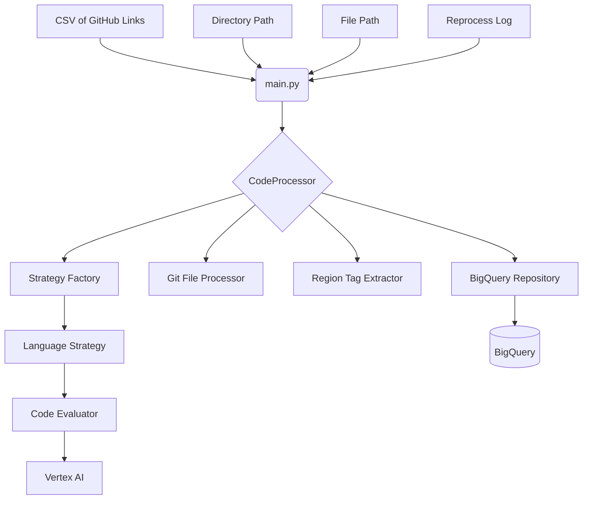
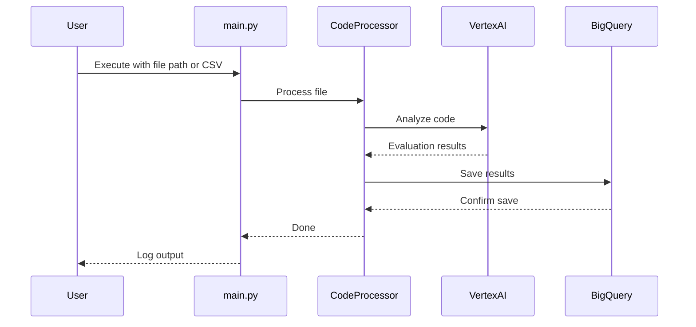

# Technical Design: Code Quality Analyzer

## 1. Introduction

This document provides a detailed technical overview of the Code Quality Analyzer, a Python-based command-line tool designed for in-depth code analysis. It is intended for engineers who need to understand, maintain, or extend the system, and it covers the system's architecture, data flow, and key technologies.

## 2. System Architecture

The Code Quality Analyzer is a monolithic Python application that is designed to be run from the command line. It is built with a modular, extensible architecture that allows for the easy addition of new language strategies and analysis tools. The system is composed of a main orchestrator, a set of core tools, a strategy factory for language-specific processing, and a BigQuery repository for data persistence.

### High-Level Architecture

### Core Components

*   **`main.py`**: This is the main entry point of the application and acts as the central orchestrator. It is responsible for:
    *   Parsing command-line arguments using the `argparse` library.
    *   Gathering the list of files to be processed, whether from a single file path, a directory, a CSV of GitHub links, or a log file of previously failed files.
    *   Using a `ThreadPoolExecutor` to manage a pool of worker threads for parallel processing of files, which significantly improves performance when analyzing large codebases.
    *   Providing a special `--eval-only` mode that allows for the quick analysis of a single file without any interaction with the BigQuery database.

*   **`get_files_from_csv`**: This function is a key part of the input processing logic. It is responsible for:
    *   Reading a CSV file of GitHub links.
    *   Extracting the unique repository names from the links.
    *   Using a `ThreadPoolExecutor` to clone or update the repositories in parallel.
    *   Dynamically determining the default branch of each repository by calling `git remote show` and parsing the output. This makes the cloning process more robust and avoids errors when a repository's default branch is not named `main`.

*   **`tools/code_processor.py`**: The `CodeProcessor` class is the heart of the application. It is responsible for orchestrating the analysis of a single file and is composed of a set of smaller, more focused components. It supports the lazy initialization of the BigQuery repository, which means that the connection to the database is only established when it is actually needed.

*   **`strategies/`**: This directory contains the language-specific logic, which is designed to be easily extensible.
    *   **`strategy_factory.py`**: A factory function that returns a `LanguageStrategy` instance based on the file extension. This allows the system to easily support new languages by simply adding a new entry to the strategy map.
    *   **`language_strategy.py`**: A single, generic strategy class that is initialized with the language name and uses the `CodeEvaluator` to perform the analysis. This design avoids the need for a separate class for each language and makes the system easier to maintain.

*   **`tools/`**: This directory contains the core logic of the application, which is separated into a set of distinct and reusable modules.
    *   **`git_file_processor.py`**: The `GitFileProcessor` class uses the `git` command-line tool via the `subprocess` module to extract a rich set of metadata about a file, including its last commit date, commit history, and a direct link to the file on GitHub.
    *   **`extract_region_tags.py`**: The `RegionTagExtractor` class uses regular expressions to find and extract all Google Cloud-style region tags from the code.
    *   **`evaluate_code_file.py`**: The `CodeEvaluator` class is responsible for the AI-powered analysis. It reads a prompt template from the `prompts/` directory, injects the code into the prompt, and then uses the `vertexai` library to call the configured Gemini model.
    *   **`bigquery.py`**: The `BigQueryRepository` class encapsulates all interactions with the BigQuery table, providing a clean and simple interface for saving the analysis results.

*   **`utils/`**: This directory contains a set of utility modules that are used throughout the application.
    *   **`logger.py`**: Configures a centralized logger for the application, which provides a consistent and easy-to-use interface for logging messages.
    *   **`exceptions.py`**: Defines a set of custom exception classes that are used to handle specific error conditions in the application.
    *   **`data_classes.py`**: Defines the `AnalysisResult` data class, which provides a structured and type-safe way to store the analysis results.

*   **`prompts/`**: This directory contains the text files that are used as templates for the AI evaluation prompts. This makes it easy to update the prompts without having to modify the code.

*   **`config.py`**: This file uses the `pydantic-settings` library to load environment variables from the `.env` file into a `Settings` object. This provides a convenient and type-safe way to manage the application's configuration.

### BigQuery Schema

The application uses a structured BigQuery table and a flattened view to store and analyze the data. The SQL definitions for these are located in the `BQ/` directory.

*   **`repo_analysis` (Table)**: This is the main table where all the raw analysis data is stored. It is designed to be write-efficient and uses a structured schema with top-level columns for frequently queried fields like `github_link`, `product_category`, and `language`. Complex, semi-structured data, such as the full commit history and the detailed evaluation results from the AI model, are stored in `JSON` columns. This design provides a good balance between query performance and the flexibility to handle evolving data from the AI model.

*   **`repo_analysis_view` (View)**: This view is the recommended interface for data analysis and visualization. It provides a clean, flattened representation of the data by:
    1.  Unnesting the `criteria_breakdown` from the `evaluation_data` JSON column to expose each criterion's score and assessment as a top-level column.
    2.  Using a `ROW_NUMBER()` window function to de-duplicate the records, ensuring that only the most recent evaluation for each unique `github_link` is included in the view. This provides a stable and reliable dataset for building dashboards and performing analysis.

## 3. Data Flow

The following sequence diagram illustrates the data flow of the application:

1.  The user executes `main.py` from the command line, providing a file path, a directory path, a CSV of GitHub links, or a log file to reprocess.
2.  `main.py` parses the arguments and gathers a list of files to process.
3.  If the `--from-csv` flag is used, the `get_files_from_csv` function is called to clone or update the repositories.
4.  The `CodeProcessor` is initialized.
5.  For each file in the list, the `CodeProcessor` orchestrates the analysis by:
    a.  Calling the `strategy_factory` to get the appropriate `LanguageStrategy`.
    b.  Calling the various tools to extract Git info, region tags, and perform the AI evaluation.
    c.  Storing the results in an `AnalysisResult` data class.
    d.  Using the `BigQueryRepository` to save the `AnalysisResult` to BigQuery.
6.  If any errors occur during processing, they are logged to a dynamically named log file in the `logs/` directory.

## 4. Key Technologies

*   **Language:** Python 3
*   **Command-Line Parsing:** `argparse`
*   **AI/LLM:** Google Gemini, via the `google-cloud-aiplatform` SDK.
*   **Database:** Google Cloud BigQuery
*   **Configuration:** `pydantic-settings` for managing environment variables.
*   **Version Control Integration:** `git` (via `subprocess`).
*   **Parallel Processing**: `ThreadPoolExecutor` for cloning and processing files in parallel.

## 5. Future Considerations

*   **Decoupling from Git:** The system currently requires the files to be within a Git repository to function correctly. This could be made optional to allow for the analysis of arbitrary, non-versioned code.
*   **Support for Other VCS:** The system could be extended to support other version control systems, such as Subversion or Mercurial.
*   **Integration with CI/CD:** The tool could be integrated into a CI/CD pipeline to automatically analyze code on every commit.
*   **Web-based UI:** A web-based UI could be developed to provide a more user-friendly way to view the analysis results and manage the system.
